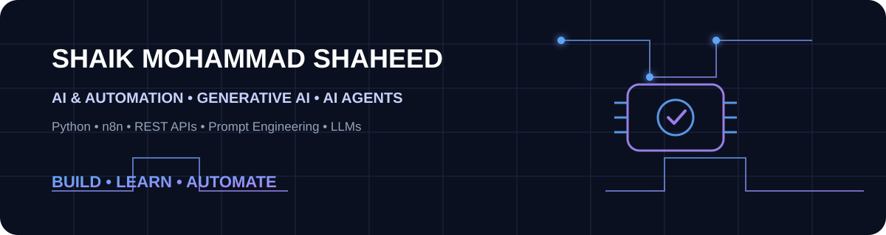

<div align="center">



[](https://github.com/shaikshahid777)

[](https://www.linkedin.com/in/shaikshaheed777/)
[](mailto:shaik.shaheed.m@gmail.com)
[](https://github.com/shaikshahid777?tab=repositories)
[](https://github.com/shaikshahid777)

</div>

---

## ⚡ About Me

I'm **Shaik Mohammad Shaheed**, a Computer Science learner focused on **AI agents, Generative AI, automation, n8n, APIs and Python**.

I build hands-on projects around LLM workflows, voice agents, prompt engineering, API orchestration, reliability, human-in-the-loop automation and practical AI assistants.

### 🧠 Current Focus

`AI Agents` `Generative AI` `Prompt Engineering` `n8n` `REST APIs` `Webhooks` `Python` `LLM Workflows`

---

## 🚀 Featured Project Universe

<table>
<tr>
<td width="50%">

### 🤖 AI CRM Lead Qualification
Voice-based lead qualification with scoring, CRM updates, scheduling and automation.

**Stack:** Vapi • n8n • HubSpot • Google Calendar • Gmail

[🚀 Open Project](https://github.com/shaikshahid777/ai-crm-lead-qualification-voice-agent)

</td>
<td width="50%">

### 🎙️ Retell AI Voice Engineering
Customer-support voice-agent work covering prompts, voice configuration, webhooks and custom LLM integration.

[🚀 Retell Projects](https://github.com/shaikshahid777/retell-ai-topic-6-custom-llm)

</td>
</tr>
<tr>
<td width="50%">

### 🔄 n8n Automation Engineering
API resilience, authentication, retries, pagination, routing, approvals and production-oriented workflows.

[🚀 n8n Projects](https://github.com/shaikshahid777?tab=repositories&q=n8n)

</td>
<td width="50%">

### 🧠 Prompt Engineering
Structured prompting, advanced strategies, frameworks, GPT instructions and evaluation projects.

[🚀 Prompt Projects](https://github.com/shaikshahid777?tab=repositories&q=prompt-engineering)

</td>
</tr>
</table>

---

## 🛠️ Tech Stack

| Area | Tools |
|---|---|
| 🤖 AI / GenAI | LLMs • Generative AI • AI Agents • Prompt Engineering |
| 🔄 Automation | n8n • Webhooks • Workflow Automation |
| 🐍 Programming | Python • JSON |
| 🌐 APIs | REST • HTTP • Authentication • API Integration |
| 🎙️ Voice AI | Retell AI • Voice Agents • Call Workflows |
| 🗄️ Data | Supabase • Databases • Structured Data |
| 🧰 Engineering | Git • GitHub • VS Code • Testing • Error Handling |

---

## 🗺️ AI Agent Engineering Roadmap

```text
Python
  ↓
JSON + Files + Environment
  ↓
HTTP / REST APIs
  ↓
Git + GitHub
  ↓
LLM Fundamentals
  ↓
LLM APIs
  ↓
Structured Outputs
  ↓
Tool / Function Calling
  ↓
Agent Architecture
  ↓
RAG + Databases
  ↓
Async + Backend Engineering
  ↓
Production AI Agents
```

---

## 📊 GitHub Analytics

<div align="center">


<br/>


</div>

---

## 🐍 Contribution Animation

<div align="center">


</div>

---

## 🎛️ Quick Actions

<div align="center">

[](https://github.com/shaikshahid777?tab=repositories)
[](https://github.com/shaikshahid777?tab=stars)
[](https://www.linkedin.com/in/shaikshaheed777/)
[](mailto:shaik.shaheed.m@gmail.com)

</div>

---

## 📚 Project Collections

- 🔹 **AI Agents & Assistants** — customer support, recruitment, HR, travel, ecommerce, CRM and knowledge assistants
- 🔹 **Voice AI** — Retell AI voice agents, inbound routing, call lifecycle events and custom LLM projects
- 🔹 **n8n Engineering** — API integrations, authentication, retries, pagination, routing, approvals and error recovery
- 🔹 **Prompt Engineering** — foundations, structured prompting, advanced strategies, frameworks and GPT instructions
- 🔹 **Python Projects** — practical beginner projects and automation foundations
- 🔹 **Marketing / Productivity AI** — content, campaigns, resume, lead and productivity assistants

[](https://github.com/shaikshahid777?tab=repositories)

---

## 🎯 Build Philosophy

> **Build → Test → Automate → Document → Improve**

I focus on turning AI concepts into practical workflows that are understandable, testable and useful.

<div align="center">

### ⭐ Building the future, one automation at a time.

[](https://github.com/shaikshahid777)

</div>
